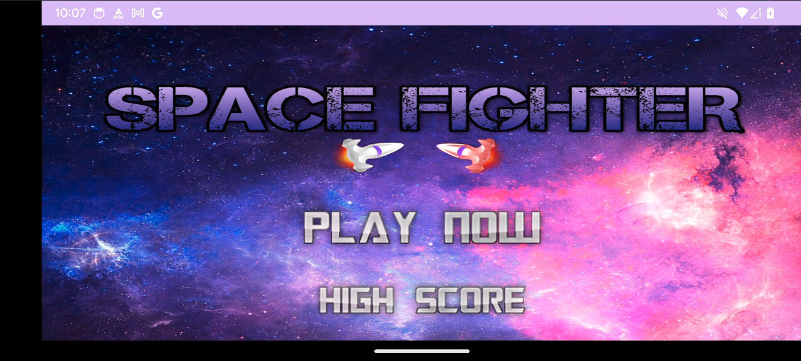
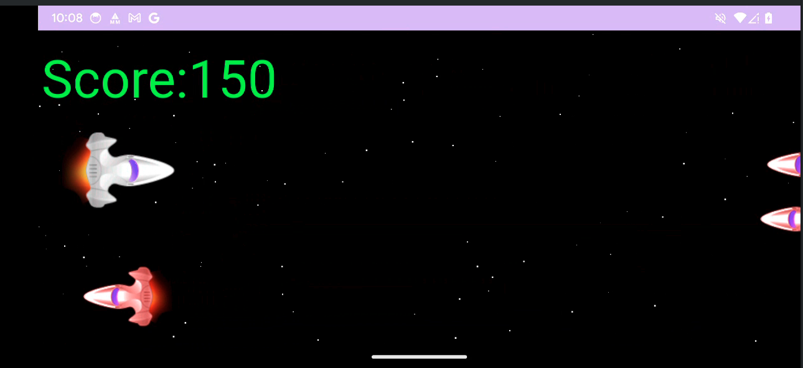

Space Fighter - Android
===========================================

Summary
-------

Welcome to SpaceFighter, this project it's an demonstration of how to build a game using only the Android SDK, with the SurfaceViews.

# SpaceFighterEDJD2223

Welcome to SpaceFighterEDJD2223, an exciting space shooter game built with love and JavaScript!

## Table of Contents

- [Description](#description)
- [Features](#features)
- [Installation](#installation)
- [Usage](#usage)
- [Contributing](#contributing)
- [Coding](#coding)
- [License](#license)

## Description

SpaceFighter is a 2D space shooter game developed using Kotlin and Android SDK based on Flappy Bird Mechanics. It offers a thrilling gaming experience with enemies, and sound. Feel the adrenaline as you navigate through space, dodging obstacles and blasting enemies in this action-packed adventure.





## Features

- **Intuitive Controls:** Easy-to-use controls for a seamless gaming experience.
- **Diverse Enemies:** Encounter a variety of enemy types with unique behaviors and challenges.
- **High Scores:** Compete with friends and fellow gamers for the top spot on the leaderboard.

## Installation

To run SpaceFighter compile the App with Android Studio and install the APK on your mobile phone follow these steps:

1. Clone the repository:

   ```bash
   git clone https://github.com/lgleto/EDJD202324.git
   ```
   
2. Enter the SpaceFighter directory.
3. Open in Android Studio compile and deploy to your phone or emulator
4. Start playing and enjoy the game!

## Usage

Touch the screen of your mobile to speed up your spaceship and lift up.
Go against your enemies to destroy them and increase your score.

## Contributing

If you'd like to contribute to SpaceFighter, please follow these steps:

Fork the repository.
Create a new branch for your feature or bug fix.
Make your changes and commit them with clear messages.
Push your changes to your fork.
Submit a pull request, explaining the changes you made.

## Coding

You can add mote sprites to this game by creating a class tha follows this pattern:

- `x` and `y` properties define the position of the sprite
- `bitmap` the visual representation
- `detectCollision` the area of collision with other sprites
- the `update(playerSpeed :Int)` function should calculate the position and the `detectCollision` of the sprite in the next frame sequence

```kotlin
class Enemy {
var bitmap : Bitmap

    var x = 0f
    var y = 0f
    var speed = 0
    var maxX = 0
    var maxY = 0

    val generator = Random()

    lateinit var detectCollision : Rect
    constructor(context: Context, width : Int, height:Int ) {
        maxY = height
        maxX = width

        bitmap = BitmapFactory.decodeResource(context.resources, R.drawable.enemy)
        x = maxX.toFloat()
        y = (generator.nextInt(maxY - bitmap.height) ).toFloat()
        speed = generator.nextInt(6) + 10

        detectCollision = Rect(x.toInt() ,y.toInt(), bitmap.width, bitmap.height)
    }

    fun update(playerSpeed :Int) {
        x -= playerSpeed
        x -= speed

        if (x < (0 - bitmap.width)){
            x = maxX.toFloat()
            y = (generator.nextInt(maxY - bitmap.height) ).toFloat()
            speed = generator.nextInt(6) + 10
        }

        detectCollision.left = x.toInt()
        detectCollision.top = y.toInt()
        detectCollision.right = x.toInt() + bitmap.width
        detectCollision.bottom = y.toInt() + bitmap.height
    }

}
```

- Than create an instance of Enemy on the class GameView and that should go through the update and draw function.

```kotlin
class GameView : SurfaceView, Runnable {
   //...
   val e: Enemy
   //...

   fun update() {
      //...
      e.update(player.speed)
      if (e.detectCollision.intersect(player.detectCollision)) {
         boom.x = e.x
         boom.y = e.y
      }

      //...
   }

   fun draw() {
      if (surfaceHolder.surface.isValid) {
         canvas = surfaceHolder.lockCanvas()
         canvas?.drawColor(Color.BLACK)
         //...
         canvas?.drawBitmap(e.bitmap, e.x, e.y, paint)
         //...
         surfaceHolder.unlockCanvasAndPost(canvas)
      }
   }

}
```

Discussion
----------

Sure there are many ways to develop games in Android, but this is the simpler and lighter way to do it. Have fun. 

License
-------

Copyright 2023 Lourenço Gomes

Licensed under [MIT License](LICENSE)